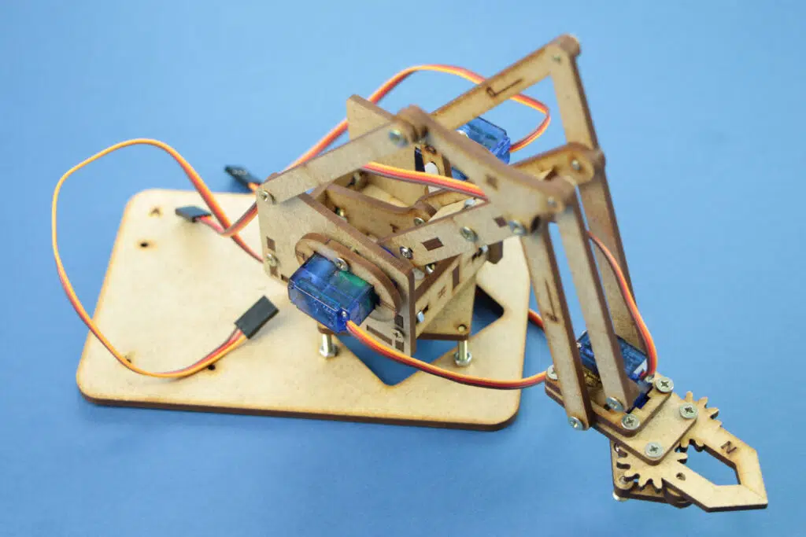

# 🤖 Braço Robótico SCARA com Arduino

<br>

Projeto acadêmico de um braço robótico SCARA desenvolvido com MDF e controlado por Arduino Uno. O controle é feito por dois joysticks, manipulando os eixos X, Y, Z e uma garra.

<br>

<p align="center">
  
</p>

<br>

## 📋 Sobre o Projeto

Este projeto foi desenvolvido como parte da P2 da disciplina de Robótica Industrial na FATEC Jundiaí. Nosso objetivo foi criar um braço robótico funcional, acessível e fácil de reproduzir.

### Características
- Estrutura em MDF, prática e econômica.
- Controle de movimentos com dois joysticks.
- Movimentação suave utilizando a biblioteca VarSpeedServo.
- Controle dos eixos X, Y, Z e da garra (W).

<br>

## 🛠️ Como Funciona

1. Conecte a estrutura eletrônica ao Arduino Uno.
2. Utilize os joysticks para controlar os movimentos.
3. Programe o Arduino com o código disponível na pasta `code`.

<br>

## 🔧 Instalação

### Requisitos
- Arduino Uno
- Servomotores (4 unidades)
- Joysticks (2 unidades)
- Biblioteca Arduino VarSpeedServo

### Passos
1. Faça o download ou clone este repositório
   
   ```git
   git clone httpsgithub.comSEU_USUARIObraco-robotico-scara.git
   ```
2. Abra o arquivo braco_scara.ino no IDE Arduino .
3. Instale a biblioteca VarSpeedServo (disponível na pasta `code`).
4. Compile e faça o upload do código para a placa Arduino Uno.

<br>

## 📂 Arquivos no Repositório
- code/: Código do Arduino.
- docs/: Documentação detalhada (PDF).
- images/: Fotos e esquemas do projeto.

<br>

## 🔥 Destaques do Projeto
- Facilidade de construção: Estrutura em MDF cortada a laser.
- Controle intuitivo: Joysticks para movimentação precisa.
- Garra funcional: Capaz de manipular pequenos objetos.
- Solução criativa: Substituição da garra em MDF por impressão 3D.

<p align="center">
   
</p>
